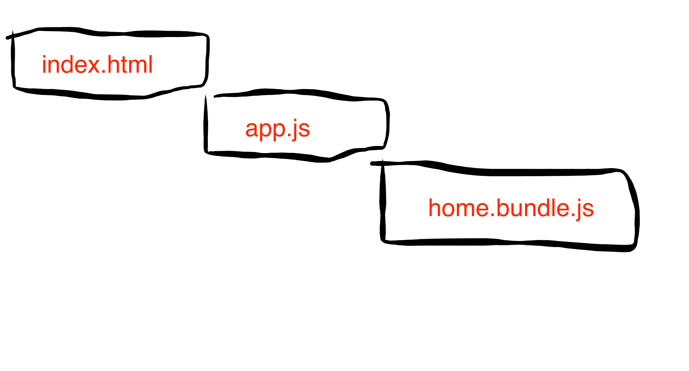
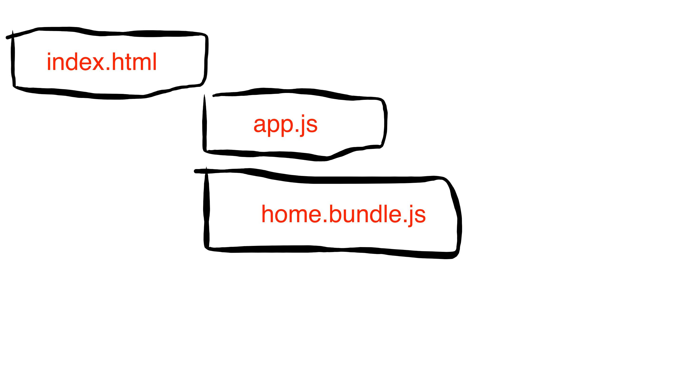
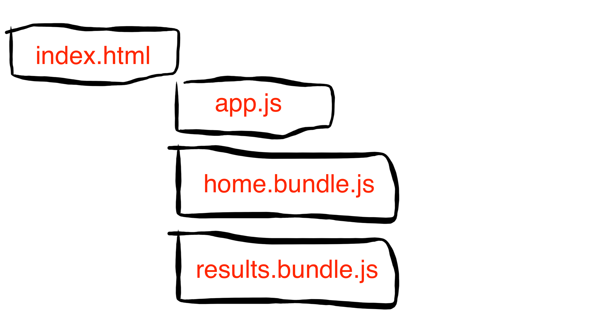
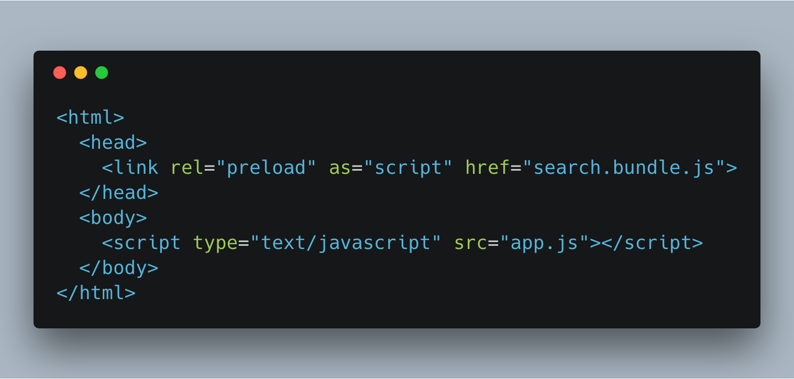
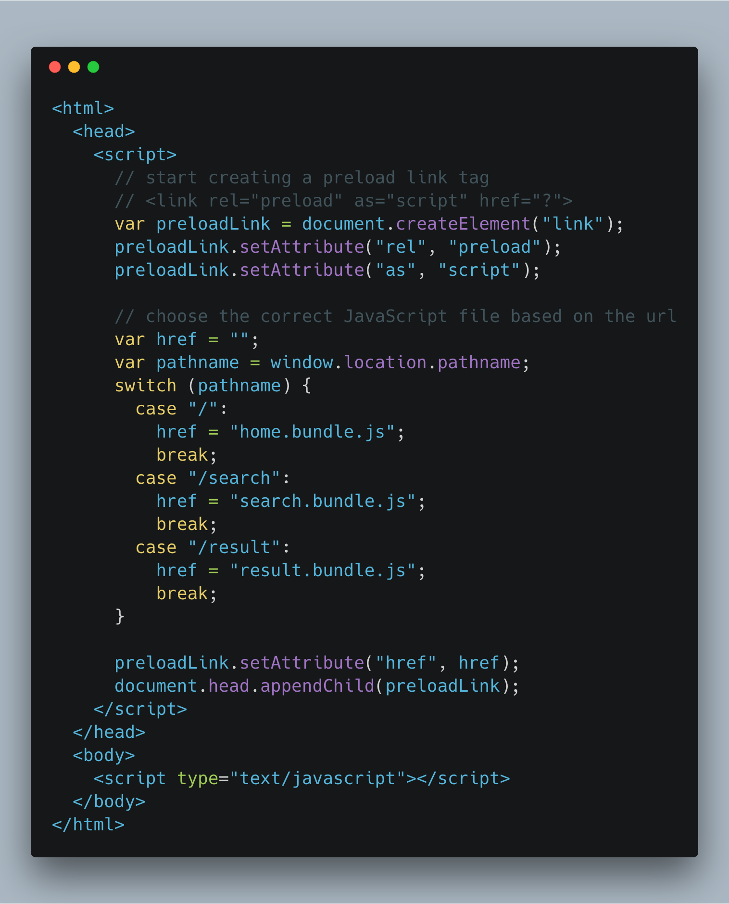

# How to dynamically add preload tags

## Getting started
``` shell
npm install
# Install dependencies

npm start
# Start express server
```

Go to `localhost:3000/a`, `localhost:3000/b`, and `localhost:3000/c`. Notice how different script files are preloaded based on what route you are on.

## Problem:
I have a client-side rendered application with code-split bundles. The network waterfall looks like this:



Our main bundle loads. Then, the main bundle loads the necessary code-split bundles that are critical for the current page.

What if we could preload our code-split bundles? The network waterfall would look like this:


We have multiple code-split bundles though. How can we preload the correct bundles that are critical for the current page?

We want to avoid forcing the user to have to download all code-split bundles. They might not ever need it and it increases the page weight.

## Solution:
We could solve this with server-side logic. Our server could return different `index.html` pages based on what route was hit. If they hit the `/search` page, we could return this:


However, we don't have a server for our application.

Instead, we can add all the logic on our frontend code.


This allows us to preload our intended scripts.